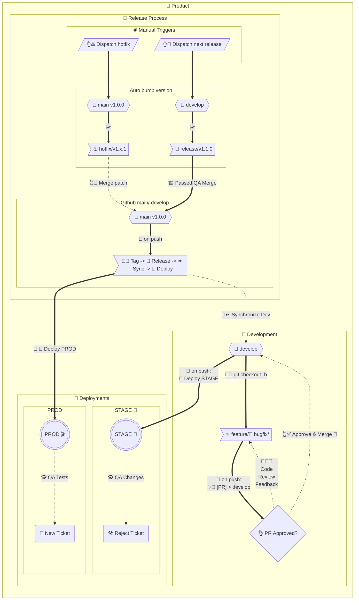

# Git Flow - Workflows 🌊

This repository represents a Git workflow, simplified through a series of actions displayed in a flowchart. The setup aligns with a basic Git flow, enabling us to maintain an agile and robust codebase.

The repository employs actions designed to follow a standard Git flow. This flow is organized into three main processes: 

1. Development Process 🚧
   Developers create `feature/` or `bugfix/` branches from `develop`. Once complete, changes are pushed back via a pull request, ensuring quality through code reviews and approvals.

2. Release Process 📢
   A new `release/` or `hotfix/` branch is manually created. Version numbers are automatically updated - minor for `release/` and patches for `hotfix/`. After QA testing, these branches merge into `main`.

3. Deployment Process 🚀
   Automated workflows handle deployment to STAGE 🧪 and PROD 🎬 environments. The `main` branch is tagged and released on GitHub before deployment.

Manual triggers allow for a `hotfix/` or `release/` initiation, while automatic version bumping ensures smooth progression. By integrating these workflows, we provide a streamlined approach for code development, review, release, and deployment.

1. The `main` branch 🌳 represents the current state of our 🎬 production code. Every commit to `main` mirrors a released version of the product.

2. Hotfixes ♨️ are constructed from the `main` branch and once completed, merged back into it. This workflow ensures that our production code remains up-to-date with any critical fixes.

3. Any updates committed to the `main` branch are automatically synchronized to the `develop` branch 🌿 by our trusty bot 🤖. This sync maintains consistency between our production and development codebases.

4. Feature enhancements ✨ and bugfixes 🐛 branch from `develop` and, once completed, are merged back into `develop`. This workflow allows for continuous integration and delivery.

5. All releases 🔖 are derived from the `develop` branch and deployed first to the staging environment 🧪 for rigorous testing and quality assurance.

6. Once a `release` passes QA testing 🧑‍🔧, it gets merged into `main`, aligning the production code with the latest version.

7. Updates to the `main` branch trigger a sequence of actions: tagging 🔖, releasing 📣, publishing 📦 on GitHub, and deploying to production 🎬 as necessary. 

8. Version bumping is fully automated through our actions, ensuring consistency and reducing manual error.

9. PRs are automatically created when branches with a prefix of `feature/` or `bugfix/` are pushed. This feature streamlines the code review process.

10. Two manual workflows exist to initiate a hotfix ♨️ or release 🔖, providing us with control over these critical processes when necessary.

### The Workflows:

- 🤖📣 Announce Release: Announces a new release on GitHub corresponding to the version found in package.json.
- 🤖🏭 Build: Executes `npm ci`, `npm run test`, and `npm run build` commands.
- 🆕 Changelog CI: Generates a comprehensive changelog.
- 🤖🚀 Deploy Production 🎬: Deploys the application to the production environment.
- 🤖🚀 Deploy Staging 🧪: Deploys the application to the staging environment.
- 👆♨️ Dispatch hotfix branch: Initiates a `hotfix/` branch and auto-bumps the `patch` number.
- 👆🔖 Dispatch next minor release: Initiates a `release/` branch and auto-bumps the `minor` number.
- 👆🔖 Dispatch next major release: Initiates a `release/` branch and auto-bumps the `major` number.
- 🤖🐛 [PR] bugfix > develop: Auto-generates a PR to `develop` branch when a `bugfix/` branch is pushed.
- 🤖✨ [PR] feature > develop: Auto-generates a PR to `develop` branch when a `feature/` branch is pushed.
- 🤖📦 Publish Release: Executes `npm ci`, `npm run build`, and `npm publish` commands.
- 🤖⏩ Synchronize develop: Syncs `develop` branch with any updates to `main`.
- 🤖🔖 Tag main: Tags the repo using the `version` found in `package.json`, announces the release,

