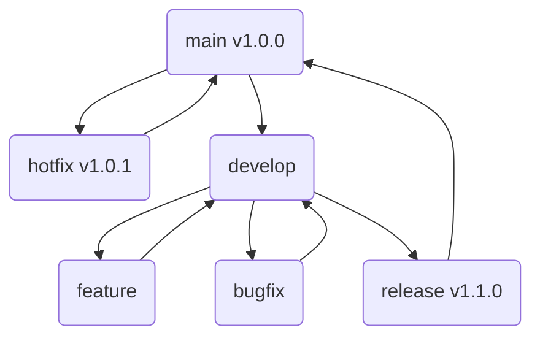

# git flow - workflows
The actions in this repo are setup to match a basic git flow as follows:

1. The `main` branch houses and matches the latest release and PRODUCTION code.
2. Hotfixes are created from the `main` branch and merged back into the `main` branch.
3. Updates to the `main` branch are synced into `develop`.
4. `feature/` & `bugfix/` branch from the `develop` branch and merged into `develop`
5. Releases are made from the `develop` branch, and upon passing QA are merged into `main`
6. Updates to the `main` branch are tagged, released, published, and deployed.
7. All version bumping is done automatically through by the actions
8. PR's are automatically created when pushing branches with a prefix of `feature/` or `bugfix/`
9. There are two dispatchable workflows that can be used to initiate a `hotfix/` or `release/`

The workflows:
- 🤖📣 Announce Release
	- Creates a release from the tag matching the version found in package.json 
- 🤖🏭 Build
	- Runs `npm ci` , `npm run test` , and `npm run build`
- changelog
	- Generates a changelog
- deploy-prod
	- Deploy to production
- deploy-staging
	- Deploy to staging
- dispatch-hotfix
	- Dispatch `hotfix/` branch and auto bump `patch` number
- dispatch-next-increment
	- Dispatch `release/` branch and auto bump `minor` number
- dispatch-next-major
	- Dispatch `release/` branch and auto bump `major` number
- pages
- pr-bugfix
	- Automatically create PR to `develop` branch when pushing `bugfix/` branch
- pr-feature
	- Automatically create PR to `develop` branch when pushing `feature/` branch
- publish
	- Runs `npm ci`, `npm run build`, and `npm publish`
- synchronize-develop
	- Keeps `develop` branch in-sync with all updates to `main`
- tag-main
	- Tag Repo using `version` found in `package.json`
	- Announce Release from same tag
	- Sync Dev - Deploy to stagin
	- Deploy to Prod
