# git flow - workflows
The actions in this repo are setup to match a basic git flow as follows:

```mermaid
graph TB 

subgraph "🎁 Product"
    subgraph release ["📢 Release Process"]
        direction TB

        subgraph repo ["Github main/ develop"]
            direction TB
            A{{"🌳 main v1.0.0"}}
            tag>"🤖🔖 Tag -> 📣 Release -> ⏩ Sync -> 🚀 Deploy"]
        end
        subgraph "🛎️ Manual Triggers"
            Hf[/"👆♨️ Dispatch hotfix "/]
            nR[/"👆🔖 Dispatch next release"/]
        end
           
        subgraph automated["Auto bump version"]
            Ab{{"🌳 main v1.0.0"}}
            H>"♨️ hotfix/v1.x.1"] 
            Db{{"🌿 develop"}} 
            R>"🔖 release v1.1.0"]    

            Hf 
            ==>
            Ab
            =="✂️"==>
            H

            nR 
            ==>
            Db
            =="✂️"==>
            R
        end

    end
    direction TB
     
    subgraph develop ["🚧 Development"]
        D{{"🌿 develop"}} 
        =="👨‍💻 git checkout -b"==>
        FB>"✨ feature/🐛 bugfix/"]
        =="🤖 on push:
        ✨🐛 [PR] > develop "==>
        pr{"👌 PR Approved?"}
        pr -."👨‍💻🔧 
        Code 
        Review 
        Feedback".-> FB
        pr -."👆✅ Approve & Merge 🔀".-> D
    end

    H-.->|"👆🔀 Merge patch"|A
   
    
	
 subgraph deploy ["🚀 Deployments"]
        direction LR
        S((("STAGE 🧪")))

        D  ==> |"🤖 on push:
        🚀 Deploy STAGE"|S
        subgraph "STAGE 🧪"
            direction LR
            
            S
            T
        end
        subgraph PROD
            direction LR
            P((("PROD 🎬"))) 
             BT("🐛 New Ticket")
            tag ==> |"🤖 🚀 Deploy PROD"|P
        end
 
        R ==>
        |"🏗️ Passed QA Merge"|A
        ==>
        |"🤖 on push"|tag
        -.->
        |"🤖⏩ Synchronize Dev"|D 
        T("🛠️ Reject Ticket") 
        P -.-> |"🕵️ QA Tests"|BT
        S -.-> |"🕵️ QA Changes"|T 
    end

end
```

1. The 🎬 `$default-branch` branch matches the latest 🔖`release` and **PRODUCTION** 🎬 code 1:1
2. Hotfixes are created from the `**$default-branch**` branch and merged back into the `**$default-branch**` branch.
3. All Updates to the `**$default-branch**` branch are auto-synced into `**develop`** via workflow 🤖
4. `feature/` & `bugfix/` branch from `develop` branch and get merged into `develop`
5. All 🔖releases are made from the 🧑‍💻 `develop` branch and get deployed to STAGING 🧪
6. Once 🧑‍🔧 QA passes the `release` it's merged into `$default-branch`
7. Updates to the `$default-branch` branch are 🔖 “tagged”, 📣 “released”, and 📦 “published” on GitHub and then deployed where applicable to **PRODUCTION** 🎬
8. All version bumping is done automatically through the actions
9. Auto-create PRs by pushing branches with a prefix of ✨`feature/` or 🐛 `bugfix/`
10. There are two manual workflows that are used to initiate a ♨️`hotfix/` or 🔖`release/`

### The workflows:
- 🤖📣 Announce Release
	- Creates a "release" post on github from the tag matching the version found in package.json 
- 🤖🏭 Build
	- Runs `npm ci` , `npm run test` , and `npm run build`
- 🆕 Changelog CI
	- Generates a changelog
- 🤖🚀 Deploy Production 🎬
	- Deploy to production
- 🤖🚀 Deploy Staging 🧪
	- Deploy to staging
- 👆♨️ Dispatch hotfix branch
	- Dispatch `hotfix/` branch and auto bump `patch` number
- 👆🔖 Dispatch next minor release
	- Dispatch `release/` branch and auto bump `minor` number
- 👆🔖 Dispatch next major release
	- Dispatch `release/` branch and auto bump `major` number
- 🤖🐛 [PR] bugfix > develop
	- Automatically create PR to `develop` branch when pushing `bugfix/` branch
- 🤖✨ [PR] feature > develop
	- Automatically create PR to `develop` branch when pushing `feature/` branch
- 🤖📦 Publish Release
	- Runs `npm ci`, `npm run build`, and `npm publish`
- 🤖⏩ Synchronize develop
	- Keeps `develop` branch in-sync with all updates to `$default-branch`
- 🤖🔖 Tag $default-branch
	- Tag Repo using `version` found in `package.json`
	- Announce Release from same tag
	- Sync Dev - Deploy to stagin
	- Deploy to Prod

